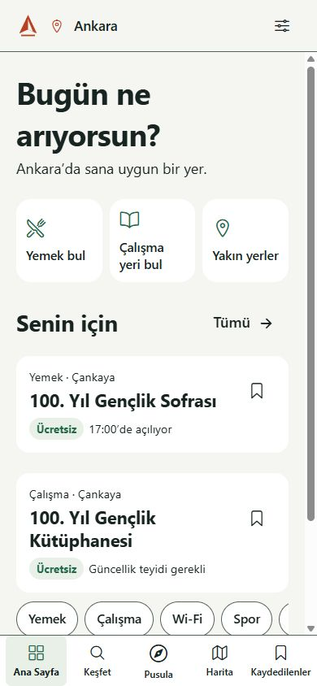
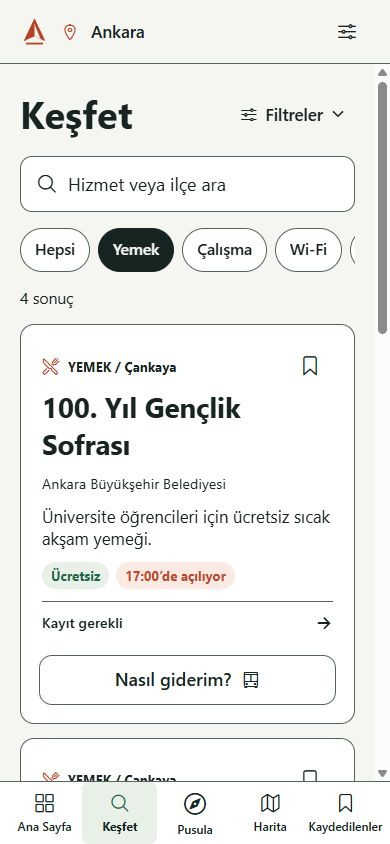
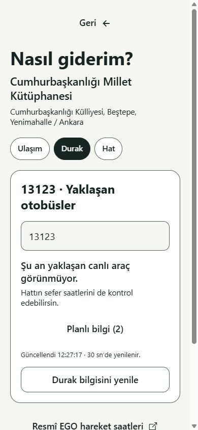

# KentPusula

**İhtiyacını söyle, şehir yol göstersin.** Ankara'nın ücretsiz ve kamusal hizmetlerini keşfetmek için Expo + React Native + TypeScript MVP.

KentPusula; yemek noktalarını, çalışma alanlarını, belediye merkezlerini ve sosyal hizmetleri tek bir mobil rehberde toplar. Haritadan veya Keşfet ekranından bir yer seçebilir, yakınındaki durakları ve o duraklara uğrayan EGO hatlarını görebilir, sefer saatlerini ve canlı otobüs tahminlerini sorgulayabilirsin.

Android, iOS ve web aynı kaynak kodunu kullanır. Bu depo **0.3.0 geliştirme sürümünü** içerir; APK dağıtımı ve fiziksel cihaz kabul testleri henüz tamamlanmamıştır. Ankara Büyükşehir Belediyesi veya EGO'nun resmî uygulaması değildir.

## Ekran görüntüleri

| Ana ekran | Keşfet | Durak sorgusu |
| --- | --- | --- |
|  |  |  |

## Çalıştırma

Node.js 22.13 veya üstü gerekir. Proje klasöründe:

```powershell
npm ci
npm run web
# İkinci terminalde EGO bağlantısı:
npm run transport:server
```

Mobil geliştirme sunucusu: `npm start`. Expo Go'nun SDK 57 uyumlu sürümüyle QR kodunu okut. Yerel Android emülatörü kuruluysa `npm run android` kullanılabilir. iOS simülatörü macOS gerektirir. Bu teslim APK/IPA veya mağaza yayını içermez.

## Ana sunum akışı

1. İlk açılıştaki isteğe bağlı bilgileri doldur veya **Şimdilik geç** seç.
2. Ayarlar'da **Sunum modu** açık olsun. Sabit senaryo: 1 Ekim 2026 Perşembe, 17.00.
3. Ana ekranda **İhtiyacını yazarak planla** bölümünü aç; şu isteği yaz veya **Örnek istek** seç:
   “20 yaşındayım, öğrenciyim. Bugün ücretsiz yemek yiyebileceğim ve ders çalışabileceğim bir yer arıyorum.”
4. **Yol göster** → iki duraklı Pusula planı: 100. Yıl Gençlik Sofrası ve yakınındaki çalışma alanı.
5. **Neden bana uygun?** → açıklamalar; **Hizmeti incele** → koşullar ve **Resmî Kaynak**.
6. Keşfet veya detay → **Nasıl giderim?** → toplu taşıma/yürüme yol tarifi, EGO hat araması, hareket saatleri ve durak sorgusu. Örnek hat: **481**.
7. Hizmeti kaydet; Kaydedilenler'de bir listeye taşı. Kayıtlar ve tercihler cihazda kalır.

Sunum modu kapatıldığında gerçek Ankara saati kullanılır. Güncel saatleri bilinmeyen hizmetler gerçek zamanlı plana yerleştirilmez. Örneğin hafta sonu, kapanıştan sonra veya 15 dakikalık bir zaman bütçesinde yemek önerisi çıkmayabilir; bu bir hata değildir.

## Tamamlanan kapsam

- Kısa onboarding, 5 ana sekme, detay ve ayarlar; Expo Router ve doğrudan hizmet bağlantıları.
- Ana ekran üç kısa eylem ve kompakt sonuçlarla başlar; yazılı plan isteğe bağlıdır. Keşfet filtreleri açılır; ulaşım hat/durak sonuçları ayrı görünür panelde açılır.
- Gerçek saat varsayılandır; manuel sunum modu açıkça etiketlenir. Durak tahminleri önplanda yenilenir, güncelliğini kaybeden dakikalar gizlenir; tarifede bugünün kalan kalkışları önce gelir.
- Açık/koyu tema, büyük yazı, yüksek kontrast, erişilebilir kontrol etiketleri, cihazda sesli okuma ve haptik geri bildirim.
- **50 harita hizmet noktası**, toplam **86 hizmet/branş kaydı**. Önceki 14 konumlu kayda 27 Çankaya Evi ve 9 ABB merkezi eklendi. 35 BELMEK branşı ile bir genel danışmanlık kaydı konumsuz kalır. Aynı tesiste farklı hizmetler bulunabilir.
- Türkçe ihtiyaç ayrıştırma, yaş/öğrenci koşulları, mesafe ve zaman bütçesiyle yerel eşleştirme.
- Açılabilir uygunluk açıklamaları ve duraklı Pusula planı.
- Arama, kategori/kolleksiyon filtreleri, sonuç yok durumları ve 12 kayıtlık sayfalar.
- Gerçek OpenStreetMap görselleri, kategori pinleri, yakınlaştırma/kaydırma, hizmet bilgi paneli ve dış navigasyon.
- Yerel kayıt listeleri; kaynak ve hizmet bilgileri uygulama paketinde, konum kalıcı depolamaya yazılmaz.

## Şeffaf sınırlar

Canlı AI/LLM API bağlantısı yoktur. İhtiyaç ayrıştırma kurallıdır; her Türkçe ifadeyi anlayacağı iddia edilmez. `IntentProvider`, `VoiceProvider`, `egoProvider` ve `ServiceRepository` arayüzleri gerçek entegrasyonlara hazırdır. API anahtarı gerektirmez.

“Örnek istek” seçeneği sabit metni doldurur; gerçek mikrofon kaydı alınmaz. EGO resmî sitesinden hat listesi, sefer saatleri ve sıralı duraklar okunur. Yol/aktarma planı dış harita uygulamasında açılır. Kesintilerde hata gösterilir; planlı seferler canlı araç tahmininden ayrılır. Yeni 36 belediye merkezi koordinatı resmî rehberden alınmıştır; Anıttepe, Sıhhiye ve Gazi yemek noktaları da ABB harita kanıtıyla düzeltilmiştir. Diğer yaklaşık konumlar etiketli kalır. Saha doğrulaması yapılmamıştır. Harita görselleri internet ister. Web'in ilk yüklemesi çevrimdışı desteklenmez; native pakette yerel katalog mevcuttur.

Kaynak okuma tarihi saha doğrulaması değildir. Tarihsel duyurular, bilinmeyen saatler ve Gençlik Sofrası kaynaklarındaki saat çelişkisi arayüzde belirtilir. Güncel kontenjan, tatil takvimi, üyelik ve kabul koşulları kurumdan teyit edilmelidir.

## Kontroller

```powershell
npm test
npm run typecheck
npx eslint .
npx expo-doctor
npm run build
```

`npm run build` web dosyaları ile Android/iOS JavaScript/Hermes paketlerini `dist/` içine üretir; imzalı native kurulum paketi değildir. Native cihaz/emülatör testi bu ortamda yapılmadı.

Bağımlılık denetimi mevcut Expo ağacında `uuid` ve `decode-uri-component` kaynaklı orta seviyeli uyarılar bildiriyor. Otomatik öneri SDK'yı eski ana sürümlere düşürüyor; uyumluluğu bozacak zorlamalı düzeltme uygulanmadı. Yayından önce bağımlılıklar yeniden değerlendirilmeli.

[Mimari](docs/ARCHITECTURE.md) · [Kaynak defteri](docs/SOURCES.md)

## Mobil ve EGO kurulumu

[Ulaşım entegrasyonu ve çalıştırma](docs/TRANSPORT.md) · [Android/iOS dağıtım hazırlığı](docs/MOBILE.md) · [Üçüncü taraf atıfları](THIRD_PARTY_NOTICES.md)
